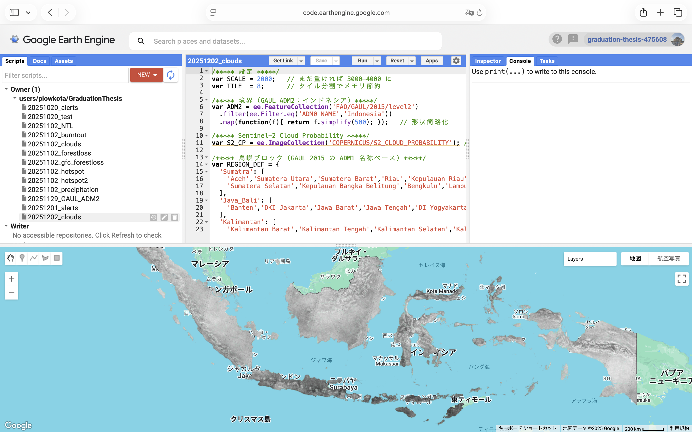
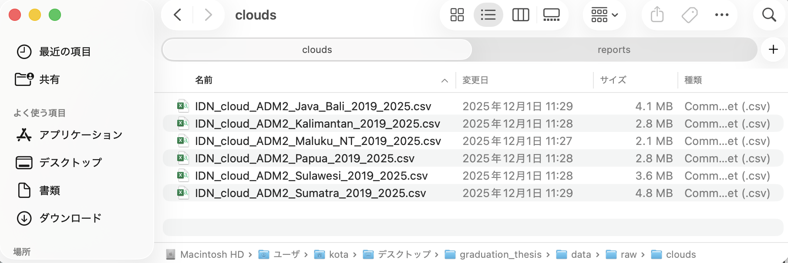
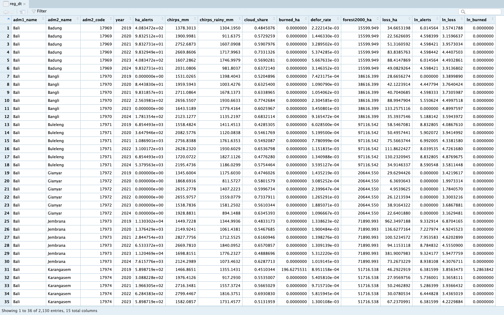
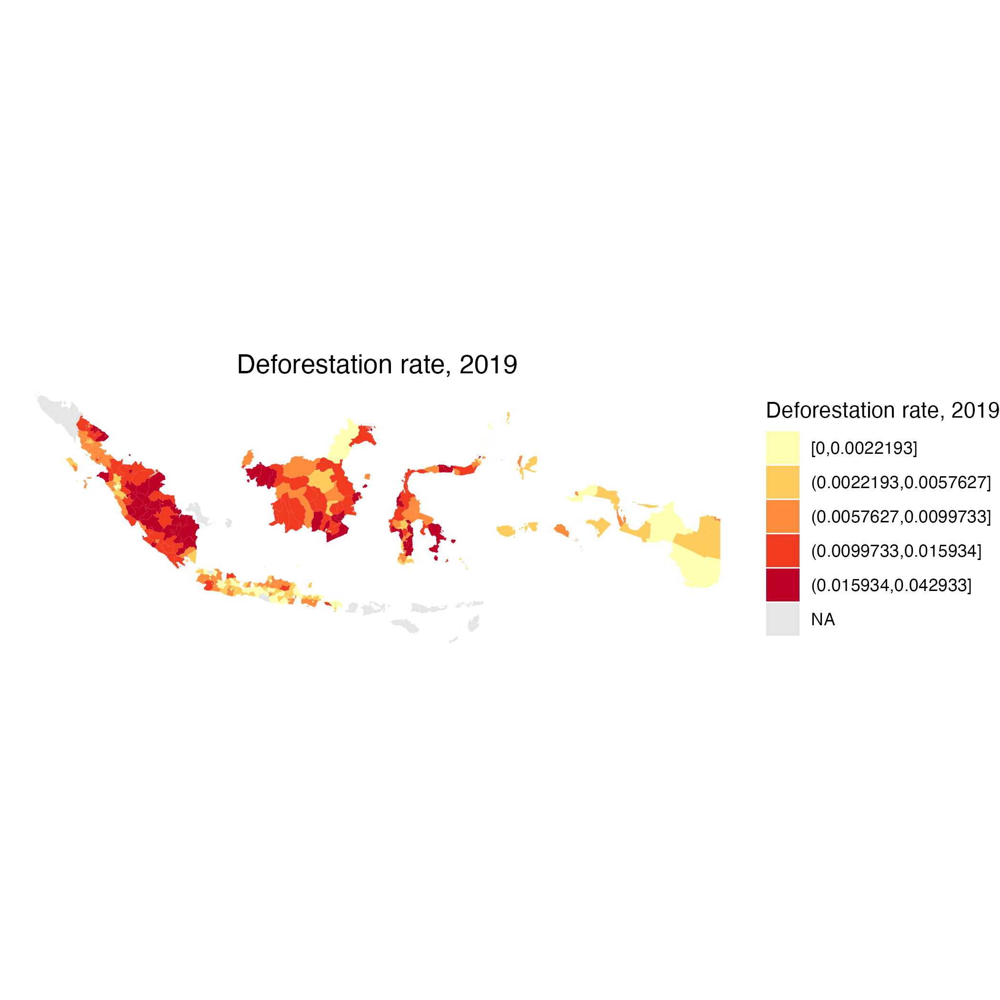
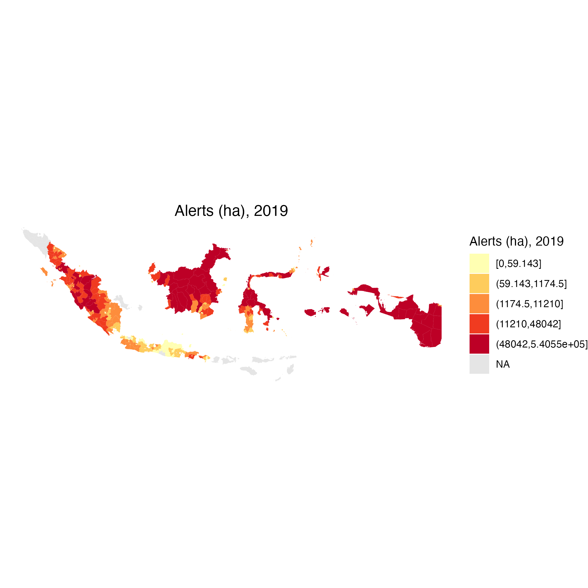
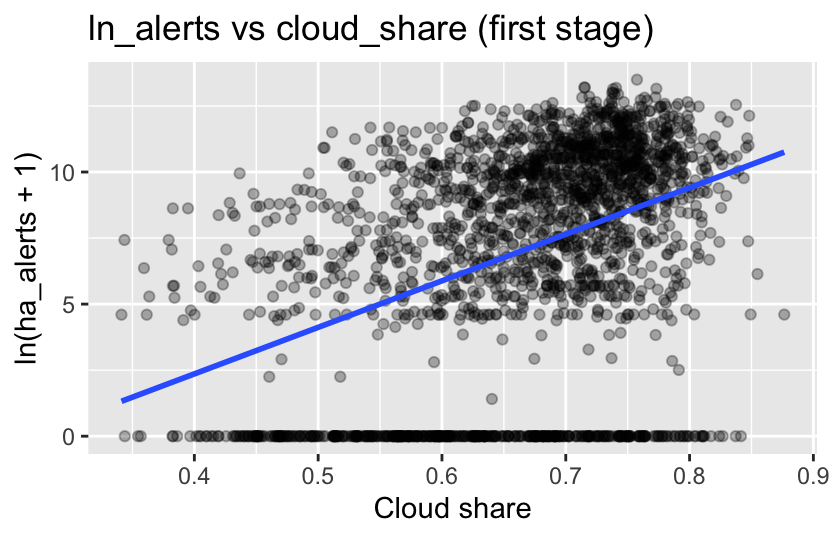

```{r setup, include=FALSE}
knitr::opts_chunk$set(echo = TRUE)

library(fixest)
library(arrow)
library(dplyr)

reg_dt <- arrow::read_parquet("../data/processed/adm2_reg_2019_2024.parquet")
```

```{r dyn_data, echo=FALSE}
library(dplyr)
library(fixest)

# adm2×year で並べてラグを作成
reg_dyn <- reg_dt %>%
  arrange(adm2_code, year) %>%
  group_by(adm2_code) %>%
  mutate(
    defor_rate_l1  = dplyr::lag(defor_rate),   # 被説明変数の1期ラグ
    ln_alerts_l1   = dplyr::lag(ln_alerts),    # alerts の1期ラグ
    cloud_share_l1 = dplyr::lag(cloud_share)   # IV の1期ラグ
  ) %>%
  ungroup() %>%
  filter(
    !is.na(defor_rate_l1),
    !is.na(ln_alerts_l1),
    !is.na(cloud_share_l1)
  )
```

分析コードは
https://github.com/kkota25/graduation_thesis.git
で公開


# 研究の目的

目的：インドネシア ADM2(県および市) レベルで構築した Global Forest Watch の integrated deforestation alerts（以下 alerts）が、同じ地域・年の森林減少（forest loss, defor_rate）を抑制するか、検証する


# データ構築と記述統計
- 対象：インドネシア ADM2 × 2019–2024 年

- 元データソース（Google Earth Engine）
  - integrated deforestation alerts（GFW Integrated Alerts）
  - forest loss（Global Forest Change / GFW）
  - 降水量（CHIRPS）
  - 焼失面積（burned area）
  - 雲量（Sentinel-2 Cloud Probability）
  
## ADM2の概観
```{r adm2_map, echo=FALSE, message=FALSE, warning=FALSE}
library(sf)
library(ggplot2)

# シェープファイルの読み込み
adm2 <- st_read("../data/raw/IDN_adm2_gaul2015/IDN_adm2_gaul2015.shp")

# ADM2 の境界を描画
ggplot(adm2) +
  geom_sf(size = 0.1) +
  theme_void() +
  ggtitle("Indonesia ADM2 (GAUL 2015)")
```

## データの整形
Google Earth engine上で ADM2×年単位に集計

↓

ローカルに CSV としてエクスポート

↓

`scripts/02_*.R` から `scripts/08_*.R` で前処理・結合

↓

最終的に`data/processed/adm2_reg_2019_2024.parquet`（ADM2×年のパネル）を作成


### Google Earth Engine 例
```{r gee clouds, echo=FALSE, out.width="80%"}

```


### 生データcsvファイル　例：clouds
```{r raw clouds data, echo=FALSE, out.width="80%"}

```


## 主な変数

- `defor_rate`：森林減少率（forest loss / 初期森林面積）
- `ln_loss`：森林損失面積（loss_ha）の log1p
- `ln_alerts`：integrated alerts 面積（ha）の log1p
- `cloud_share`：雲天ピクセル比率（年平均）
- `chirps_mm`：年降水量（mm）
- `burned_ha`：焼失面積（ha）


## データ
```{r data, echo=FALSE}
reg_dt <- arrow::read_parquet("../data/processed/adm2_reg_2019_2024.parquet")
```

```{r data view, echo=FALSE, out.width="80%"}

```


## 記述統計量
```{r data summary, echo=FALSE}
summary(reg_dt)
```


## 主要な図

### 森林減少率の空間分布（例：2019 年）
```{r defor spatial distributuon, echo=FALSE, out.width="80%"}

```

2019 年時点では、特にカリマンタン島とスマトラ島の一部 ADM2 で defor_rate が高く、
ジャワ島では森林減少がほとんど観測されない。

### alerts の空間分布（例：2019 年）
```{r alerts spatial distributuon, echo=FALSE, out.width="80%"}

```

### cloud_share と ln_alerts の散布図（操作変数の妥当性?）


第一段階：

$$
\ln(alerts_{i,t-1}+1)
= \beta_1 \,cloud\_share_{i,t-1}
+ \beta_2 \,chirps\_mm_{it}
+ \beta_3 \,burned\_ha_{it}
+ \alpha_i + \lambda_t + v_{it}.\\
$$

第ニ段階：

$$
defor\_rate_{it}
= \beta_1 \,\widehat{\ln(alerts_{i,t-1}+1)}
+ \beta_2 \,chirps\_mm_{it}
+ \beta_3 \,burned\_ha_{it}
+ \alpha_i + \lambda_t + \varepsilon_{it}.
$$


```{r scatter clouds alerts, echo=FALSE, out.width="80%"}

```

雲量シェアが高いほど ln_alerts が低くなる負の相関が見られ、cloud_share が alerts の観測可能性に影響していることを示唆。
(後の分析でcloud_share の t ≈ -2.4（F ≈ 5.8）で弱い操作変数とわかる)


# 分析

## ラグ変数の作成
```{r make_lags, include=FALSE}
library(dplyr)

reg_lag <- reg_dt %>%
  arrange(adm2_code, year) %>%
  group_by(adm2_code) %>%
  mutate(
    ln_alerts_l1   = dplyr::lag(ln_alerts,   n = 1),  # ln_alerts の1期ラグ
    cloud_share_l1 = dplyr::lag(cloud_share, n = 1)  # cloud_share の1期ラグ
  ) %>%
  ungroup() %>%
  filter(!is.na(ln_alerts_l1), !is.na(cloud_share_l1))  # 2019年などラグ欠損を落とす
```

## Baseline OLS
### Model FE OLS
ベースラインの固定効果付き回帰式は次の通り
$$
defor\_rate_{it}
= \beta_1 \ln(alerts_{it}+1)
+ \beta_2 \,chirps\_mm_{it}
+ \beta_3 \,burned\_ha_{it}
+ \alpha_i + \lambda_t + u_{it},
$$

```{r Baseline_OLS, echo=FALSE}
ols_defor <- feols(
  defor_rate ~ ln_alerts + chirps_mm + burned_ha |
    adm2_code + year,
  data    = reg_dt,
  cluster = ~adm2_code
)

summary(ols_defor)
```

### 解釈(Baseline FEOLS)
- ln_alerts：0.000283（p≈0.13）
アラート面積が増えるほど defor_rate は増える方向ですが、統計的に有意でない。
→ 「alerts が多いほど森林減少率が高い」という関係は、はっきりとは確認できない。

- chirps_mm：-0.00000220（p≈0.029）
降水量が多い地域ほど defor_rate が有意に低い。
→ 雨が多いと森林減少が抑えられている（または起きにくい）傾向。

- burned_ha：ほぼ 0（p≈0.99）
焼失面積は、この仕様では defor_rate とほとんど関係が見られない。


## 2SLS 
### first stage Model
$$
\ln(alerts_{it} + 1)
= \beta_1 \,cloud\_share_{it}
+ \beta_2 \,chirps\_mm_{it}
+ \beta_3 \,burned\_ha_{it}
+ \alpha_i + \lambda_t + v_{it}.
$$

```{r 2SLS first_stage, echo=FALSE}
fs_ln_alerts <- feols(
  ln_alerts ~ cloud_share + chirps_mm + burned_ha |
    adm2_code + year,
  data    = reg_dt,
  cluster = ~adm2_code
)

summary(fs_ln_alerts)
```

### 解釈(2SLS 第一段階)
- ln_alerts：0.000283（p≈0.13）
アラート面積が増えるほど defor_rate は増える方向ですが、統計的に有意でない
→ 「alerts が多いほど森林減少率が高い」という関係は、はっきりとは確認できない

- chirps_mm：-0.00000220（p≈0.029）
降水量が多い地域ほど defor_rate が有意に低い。
→ 雨が多いと森林減少が抑えられている（または起きにくい）傾向。

- burned_ha：ほぼ 0（p≈0.99）
焼失面積は、この仕様では defor_rate とほとんど関係が見られない。


## 2SLS second stage
### second stage model
$$
defor\_rate_{it}
= \beta_1 \,\widehat{\ln(alerts_{it}+1)}
+ \beta_1 \,chirps\_mm_{it}
+ \beta_1 \,burned\_ha_{it}
+ \alpha_i + \lambda_t + \varepsilon_{it}.
$$

```{r 2SLS_second_stage, echo=FALSE}
iv_defor <- feols(
  defor_rate ~ chirps_mm + burned_ha |   # 外生のコントロール
    adm2_code + year |                   # 固定効果
    ln_alerts ~ cloud_share,             # 内生 ~ IV
  data    = reg_dt,
  cluster = ~adm2_code
)

summary(iv_defor)

```

### 解釈(2SLS 第ニ段階)
- ln_alerts：0.000283（p≈0.13）
アラート面積が増えるほど defor_rate は増える方向ですが、統計的に有意でない。
→ 「alerts が多いほど森林減少率が高い」という関係は、はっきりとは確認できない。

- chirps_mm：-0.00000220（p≈0.029）
降水量が多い地域ほど defor_rate が有意に低い。
→ 雨が多いと森林減少が抑えられている（または起きにくい）傾向。

- burned_ha：ほぼ 0（p≈0.99）
焼失面積は、この仕様では defor_rate とほとんど関係が見られない。


## 2SLS with a lag
### first stage

$$
\ln(alerts_{i,t-1}+1)
= \beta_1 \,cloud\_share_{i,t-1}
+ \beta_2 \,chirps\_mm_{it}
+ \beta_3 \,burned\_ha_{it}
+ \alpha_i + \lambda_t + v_{it}.
$$

```{r 2SLS_first_stage_lag, echo=FALSE}
fs_ln_alerts_l1 <- feols(
  ln_alerts_l1 ~ cloud_share_l1 + chirps_mm + burned_ha |
    adm2_code + year,
  data    = reg_lag,
  cluster = ~adm2_code
)

summary(fs_ln_alerts_l1)
```

### 解釈(2SLS ラグあり 第一段階)
- cloud_share_l1：-2.75（p≈0.00013, t≈-3.88）
  - 雲量の 1 期ラグと ln_alerts の 1 期ラグの負の関係がかなり強くなっている。
  - t²≈15 → F≈15 と、経験則の 10 を上回り「IV としてはだいぶ強い」。
- chirps_mm：0.000066（p≈0.47）
  - ここでは降水量は ln_alerts_l1 と有意な関係を持たない。
- burned_ha：正で p≈0.075（10%有意かどうかギリギリ）
→ ラグを取ることで、cloud_share_l1 は ln_alerts_l1 に対する「強い操作変数」になっている。

### Second stage
$$
defor\_rate_{it}
= \beta_1 \,\widehat{\ln(alerts_{i,t-1}+1)}
+ \beta_2 \,chirps\_mm_{it}
+ \beta_3 \,burned\_ha_{it}
+ \alpha_i + \lambda_t + \varepsilon_{it}.
$$

```{r 2SLS_second_stage_lag, echo=FALSE}
iv_defor_l1 <- feols(
  defor_rate ~ chirps_mm + burned_ha |      # 外生コントロール（当期）
    adm2_code + year |                      # 固定効果
    ln_alerts_l1 ~ cloud_share_l1,          # 内生 ~ IV（ともに1期ラグ）
  data    = reg_lag,
  cluster = ~adm2_code
)

summary(iv_defor_l1)
```

### 解釈(2SLS ラグあり 第ニ段階)
- fit_ln_alerts_l1：0.00049（p≈0.56）
  - 点推定はごく小さい正の値。p 値 0.56 と大きく、有意ではない。
  - 「前年 alerts が多いほど翌年の defor_rate が変わる」という強い evidence は得られていない。
- chirps_mm：-0.00000215（p≈0.032）
  - ここでは再び有意に負。IV でも「降水量が多い地域ほど defor_rate が低い」という結果は頑健。
- burned_ha：ほぼ 0（p≈0.998）
→ ラグ付き 2SLS では、
　- first stage はかなり強くなったが、second stage の alerts_l1 の係数は依然として有意でない。
　- 「alerts が翌年の deforestation を抑制（または増加）している」という明確な証拠は得られていない。


## ダイナミック・パネル 2SLS


第一段階（first stage）：

$$
\begin{aligned}
\ln(alerts_{i,t-1}+1)
  &= \pi_0
   + \pi_1 \,cloud\_share_{i,t-1}
   + \pi_2 \,defor\_rate_{i,t-1} \\
  &\quad
   + \pi_3 \,chirps\_mm_{it}
   + \pi_4 \,burned\_ha_{it}
   + \alpha_i + \lambda_t + v_{it}.
\end{aligned} 
$$

第二段階（second stage：構造式）：

$$
defor\_rate_{it}
= \beta_0
 + \beta_1 \,\widehat{\ln(alerts_{i,t-1}+1)}
 + \beta_2 \,defor\_rate_{i,t-1} \\
 + \beta_3 \,chirps\_mm_{it}
 + \beta_4 \,burned\_ha_{it}
 + \alpha_i + \lambda_t + \varepsilon_{it}.
$$


```{r dyn_2sls first, echo=FALSE}
dyn_iv <- feols(
  defor_rate ~ defor_rate_l1 + chirps_mm + burned_ha |
    adm2_code + year |
    ln_alerts_l1 ~ cloud_share_l1,
  data    = reg_dyn,
  cluster = ~adm2_code
)

# first stage
summary(dyn_iv, stage = 1)
```

```{r dyn_2sls second, echo=FALSE}
# second stage
summary(dyn_iv, stage = 2)
```


# 技術的な限界
## データの限界
- Assunção et al. (2023)はデータは自治体×月の長期パネルを使用
- 本研究は ADM2×年で 2019–2024 の 6 年のみ。
→時間があれば、ADM2×月or ADM2×週のデータを取得

- Google Earth Engineでは思いデータを出力するのに時間がかかる(時間的制約)

- Alertsのデータは1000mメッシュで取得（当初は10m）


# 今後の改善案
## ラグの導入


## 政策（enforcement）に近い変数を導入する
インドネシアで利用可能な政策・制度の変数が取れるなら、以下のような強化が考えられる

### 現実的に検討できそうな候補
保護区・保全林（protected areas, conservation forest）比率
・ADM2 内の protected area 面積シェア（固定的な cross-section）を計算し、
・これと year を交差させたダミー（high-PA × post-2019）などを入れる。

### どう使うか
コントロール or 交互作用項 として回帰式に入れる(?)


## 集計頻度を上げる

### 月次・四半期集計のメリット
雲量と alerts の「観測タイミング」の連動をより精密に捉えられる。
first stage が強くなる可能性がある（雲の短期ショックが効いてくる）。

### 実務的な課題
今のパイプラインは ADM2×「年」単位で GEE→CSV→parquet を設計しているので、月次にすると
・GEE のコードを ADM2×month 出力に全面書き換え
・R 側の 02_, 03_ スクリプトも全て修正
・データ量・計算負荷も増加
卒論の残り時間とのトレードオフが大きい


