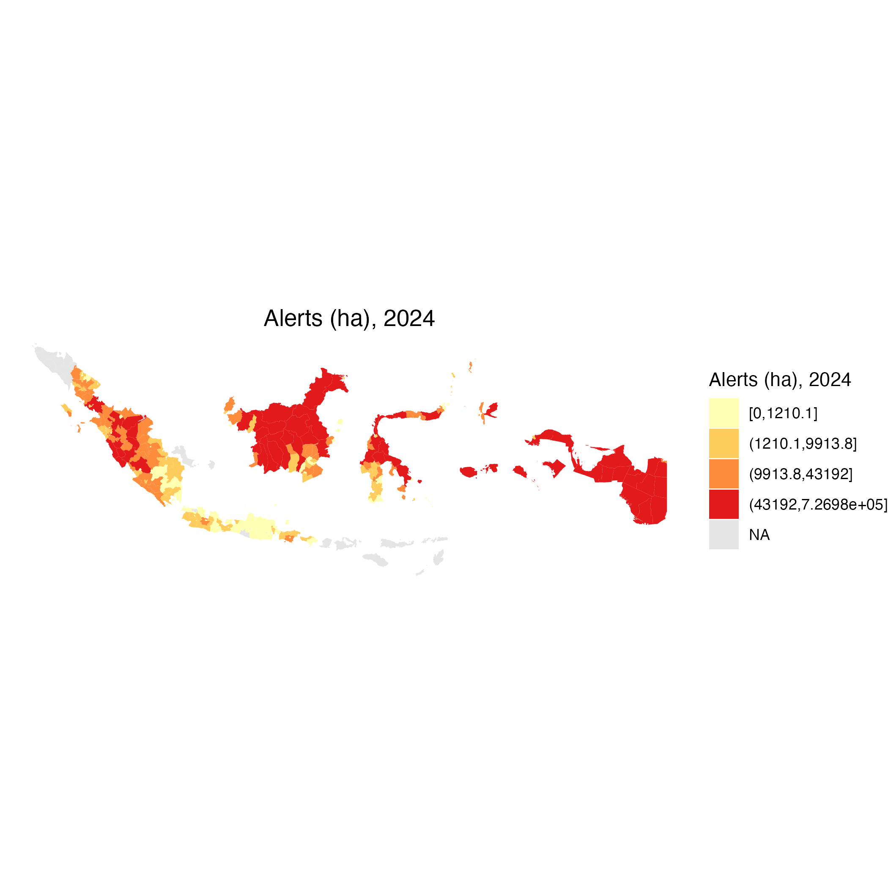
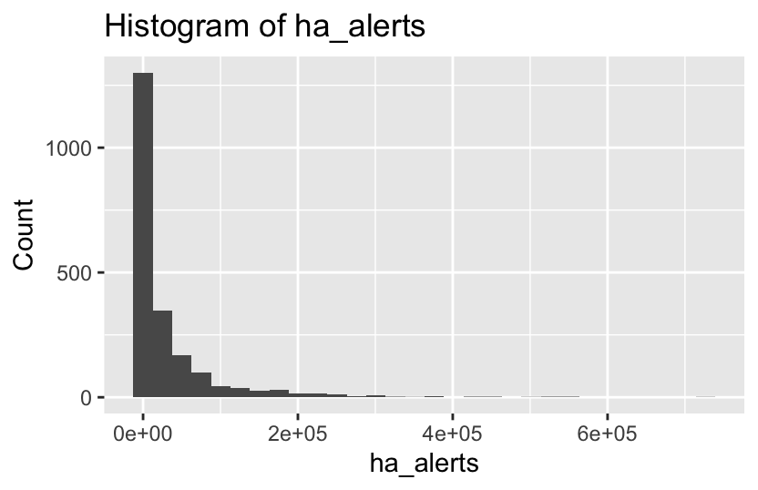
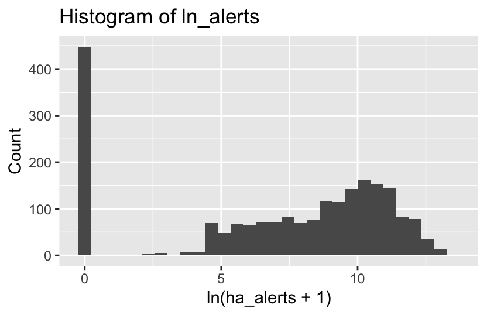

```{r setup, include=FALSE}
knitr::opts_chunk$set(echo = TRUE)

reg_dt <- arrow::read_parquet("../data/processed/adm2_reg_2019_2024.parquet")

proj_root <- rprojroot::find_rstudio_root_file()  
out_file  <- file.path(proj_root, "outputs", "tables", "reg_dyn_2sls.tex")
```


# データ構築と記述統計
- 対象：インドネシア ADM2 × 2019–2024 年

- 元データソース（Google Earth Engine）
  - integrated deforestation alerts（GFW Integrated Alerts）
  - forest loss（Global Forest Change / GFW）
  - 降水量（CHIRPS）
  - 焼失面積（burned area）
  - 雲量（Sentinel-2 Cloud Probability）
  
## ADM2
```{r adm2_map, echo=FALSE, message=FALSE, warning=FALSE}

# load adm2 shape files 
adm2 <- st_read("../data/raw/IDN_adm2_gaul2015/IDN_adm2_gaul2015.shp")

# depict the adm2 boundaries 
ggplot(adm2) +
  geom_sf(size = 0.1) +
  theme_void() +
  ggtitle("Indonesia ADM2 (GAUL 2015)")
```


## main variables

- `defor_rate`：doforestation rate（forest loss / 初期森林面積）
- `ln_loss`：森林損失面積（loss_ha）の log1p
- `ln_alerts`：integrated alerts 面積（ha）の log1p
- `cloud_share`：雲天ピクセル比率（年平均）
- `chirps_mm`：年降水量（mm）
- `burned_ha`：焼失面積（ha）


## data

Burgess et al. (2012)は、分析対象をインドネシア全土ではなく、
「main forest islands」= Sumatra, Kalimantan, Sulawesi, Papua に限定している。Java, Bali, NTB/NTT, Maluku, Riau Islands などは「baseline 期に森林被覆がごくわずか（negligible forest cover）」とし、サンプルから除外している。

## descriptive stats
```{r data summary, echo=FALSE}
summary(reg_dt)
```


## 主要な図

### spatial distribution for deforestation in 2019
```{r defor spatial distributuon, echo=FALSE, out.width="80%"}
knitr::include_graphics("../outputs/figures/choropleth/defor/map_defor_rate_2019.png")
```

2019 年時点では、特にカリマンタン島とスマトラ島の一部 ADM2 で defor_rate が高く、
ジャワ島では森林減少がほとんど観測されない。

### alertsの空間分布（例：2019 年）

```{r alerts spatial distributuon, echo=FALSE, out.width="80%"}

```

### alerts の分布（例：2019 年）
```{r alerts distributuon, echo=FALSE, out.width="80%"}


```


# 分析


## Baseline OLS
### Model FE OLS
Baseline fixed effects model
$$
defor\_rate_{it}
= \beta_1 \ln(alerts_{it}+1)
+ \beta_2 \,chirps\_mm_{it}
+ \beta_3 \,burned\_ha_{it}
+ \alpha_i + \lambda_t + u_{it},
$$

```{r Baseline_FE_OLS, echo=FALSE}
summary(ols_defor)
```

### 解釈(Baseline FEOLS)
- ln_alerts：0.000283（p≈0.13）
アラート面積が増えるほど defor_rate は増える方向ですが、統計的に有意でない。
→ 「alerts が多いほど森林減少率が高い」という関係は、はっきりとは確認できない。

- chirps_mm：-0.00000220（p≈0.029）
降水量が多い地域ほど defor_rate が有意に低い。
→ 雨が多いと森林減少が抑えられている（または起きにくい）傾向。

- burned_ha：ほぼ 0（p≈0.99）
焼失面積は、この仕様では defor_rate とほとんど関係が見られない。


## 2SLS 
### first stage
$$
\ln(alerts_{it} + 1)
= \beta_1 \,cloud\_share_{it}
+ \beta_2 \,chirps\_mm_{it}
+ \beta_3 \,burned\_ha_{it}
+ \alpha_i + \lambda_t + v_{it}.
$$

### second stage
$$
defor\_rate_{it}
= \beta_1 \,\widehat{\ln(alerts_{it}+1)}
+ \beta_1 \,chirps\_mm_{it}
+ \beta_1 \,burned\_ha_{it}
+ \alpha_i + \lambda_t + \varepsilon_{it}.
$$

### 解釈(2SLS 第一段階)

```{r 2SLS first_stage, echo=FALSE}
fs_ln_alerts <- feols(
  ln_alerts ~ cloud_share + chirps_mm + burned_ha |
    adm2_code + year,
  data    = reg_dt,
  cluster = ~adm2_code
)

summary(fs_ln_alerts)
```

- ln_alerts：0.000283（p≈0.13）
アラート面積が増えるほど defor_rate は増える方向ですが、統計的に有意でない
→ 「alerts が多いほど森林減少率が高い」という関係は、はっきりとは確認できない

- chirps_mm：-0.00000220（p≈0.029）
降水量が多い地域ほど defor_rate が有意に低い。
→ 雨が多いと森林減少が抑えられている（または起きにくい）傾向。

- burned_ha：ほぼ 0（p≈0.99）
焼失面積は、この仕様では defor_rate とほとんど関係が見られない。


### 解釈(2SLS 第2段階)

```{r 2SLS_second_stage, echo=FALSE}
iv_defor <- feols(
  defor_rate ~ chirps_mm + burned_ha |   # 外生のコントロール
    adm2_code + year |                   # 固定効果
    ln_alerts ~ cloud_share,             # 内生 ~ IV
  data    = reg_dt,
  cluster = ~adm2_code
)

summary(iv_defor)

```

- ln_alerts：0.000283（p≈0.13）
アラート面積が増えるほど defor_rate は増える方向ですが、統計的に有意でない。
→ 「alerts が多いほど森林減少率が高い」という関係は、はっきりとは確認できない。

- chirps_mm：-0.00000220（p≈0.029）
降水量が多い地域ほど defor_rate が有意に低い。
→ 雨が多いと森林減少が抑えられている（または起きにくい）傾向。

- burned_ha：ほぼ 0（p≈0.99）
焼失面積は、この仕様では defor_rate とほとんど関係が見られない。

```{r export_table_5_2_nolag, echo=FALSE, message=FALSE, warning=FALSE}

out_nolag <- "../outputs/tables/table_5_2_iv_nolag.tex"

modelsummary(
  list(
    "First stage: ln(alerts+1)"  = fs_ln_alerts,
    "Second stage: defor_rate"   = iv_defor
  ),
  output   = out_nolag,
  stars    = TRUE,
  statistic = "std.error",
  gof_omit = "IC|Log|Adj|Within|FE"
)

# 確認（任意）
file.exists(out_nolag)
```


## 2SLS with a lag
### first stage

$$
\ln(alerts_{i,t-1}+1)
= \beta_1 \,cloud\_share_{i,t-1}
+ \beta_2 \,chirps\_mm_{it}
+ \beta_3 \,burned\_ha_{it}
+ \alpha_i + \lambda_t + v_{it}.
$$

### Second stage

$$
defor\_rate_{it}
= \beta_1 \,\widehat{\ln(alerts_{i,t-1}+1)}
+ \beta_2 \,chirps\_mm_{it}
+ \beta_3 \,burned\_ha_{it}
+ \alpha_i + \lambda_t + \varepsilon_{it}.
$$


### 解釈(2SLS ラグあり 第一段階)

```{r 2SLS_first_stage_lag, echo=FALSE}
fs_ln_alerts_l1 <- feols(
  ln_alerts_l1 ~ cloud_share_l1 + chirps_mm + burned_ha |
    adm2_code + year,
  data    = reg_lag,
  cluster = ~adm2_code
)

summary(fs_ln_alerts_l1)
```

- cloud_share_l1：-2.75（p≈0.00013, t≈-3.88）
  - 雲量の 1 期ラグと ln_alerts の 1 期ラグの負の関係がかなり強くなっている。
  - t²≈15 → F≈15 と、経験則の 10 を上回り「IV としてはだいぶ強い」。
- chirps_mm：0.000066（p≈0.47）
  - ここでは降水量は ln_alerts_l1 と有意な関係を持たない。
- burned_ha：正で p≈0.075（10%有意かどうかギリギリ）
→ ラグを取ることで、cloud_share_l1 は ln_alerts_l1 に対する「強い操作変数」になっている。


### 解釈(2SLS ラグあり 第ニ段階)

```{r 2SLS_second_stage_lag, echo=FALSE}
iv_defor_l1 <- feols(
  defor_rate ~ chirps_mm + burned_ha |      # 外生コントロール（当期）
    adm2_code + year |                      # 固定効果
    ln_alerts_l1 ~ cloud_share_l1,          # 内生 ~ IV（ともに1期ラグ）
  data    = reg_lag,
  cluster = ~adm2_code
)

summary(iv_defor_l1)
```

- fit_ln_alerts_l1：0.00049（p≈0.56）
  - 点推定はごく小さい正の値。p 値 0.56 と大きく、有意ではない。
  - 「前年 alerts が多いほど翌年の defor_rate が変わる」という強い evidence は得られていない。
- chirps_mm：-0.00000215（p≈0.032）
  - ここでは再び有意に負。IV でも「降水量が多い地域ほど defor_rate が低い」という結果は頑健。
- burned_ha：ほぼ 0（p≈0.998）
→ ラグ付き 2SLS では、
　- first stage はかなり強くなったが、second stage の alerts_l1 の係数は依然として有意でない。
　- 「alerts が翌年の deforestation を抑制（または増加）している」という明確な証拠は得られていない。


### 2) ラグあり（preferred）：First stage + Second stage を1枚に出す

```{r export_table_5_2_lag, echo=FALSE, message=FALSE, warning=FALSE}

out_lag <- "../outputs/tables/table_5_2_iv_lag.tex"

modelsummary(
  list(
    "First stage (lag): ln(alerts+1)_{t-1}" = fs_ln_alerts_l1,
    "Second stage (lag): defor_rate_t"      = iv_defor_l1
  ),
  output   = out_lag,
  stars    = TRUE,
  statistic = "std.error",
  gof_omit = "IC|Log|Adj|Within|FE"
)

file.exists(out_lag)
```

## ダイナミック・パネル 2SLS

第一段階（first stage）：

$$
\begin{aligned}
\ln(alerts_{i,t-1}+1)
  &= \pi_0
   + \pi_1 \,cloud\_share_{i,t-1}
   + \pi_2 \,defor\_rate_{i,t-1} \\
  &\quad
   + \pi_3 \,chirps\_mm_{it}
   + \pi_4 \,burned\_ha_{it}
   + \alpha_i + \lambda_t + v_{it}.
\end{aligned} 
$$

第二段階（second stage：構造式）：

$$
defor\_rate_{it}
= \beta_0
 + \beta_1 \,\widehat{\ln(alerts_{i,t-1}+1)}
 + \beta_2 \,defor\_rate_{i,t-1} \\
  &\quad
 + \beta_3 \,chirps\_mm_{it}
 + \beta_4 \,burned\_ha_{it}
 + \alpha_i + \lambda_t + \varepsilon_{it}.
$$


```{r dyn_2sls first, echo=FALSE}
dyn_iv <- feols(
  defor_rate ~ defor_rate_l1 + chirps_mm + burned_ha |
    adm2_code + year |
    ln_alerts_l1 ~ cloud_share_l1,
  data    = reg_dyn,
  cluster = ~adm2_code
)


# first stage
summary(dyn_iv, stage = 1)
```

```{r dyn_2sls_second, echo=FALSE}
# second stage
summary(dyn_iv, stage = 2)
```


# 分析地域の選択

```{r fig_evergreen_2019, echo=FALSE, out.width="80%", fig.cap="熱帯常緑広葉樹の被覆率（2019年）"}
knitr::include_graphics("../outputs/figures/choropleth/map_evergreen_share_2019.png")
```


# 自治体の選定
- ステップ1：
「main forest islands」に近い島（例：Sumatra, Kalimantan, Sulawesi, Papua）に限定。

- ステップ2：
forest2000_ha / total_ha が 2–5% 未満の ADM2 を落とす（Assunção の 2％ルールの district 版）。

- ステップ3：
2019–2024 の loss_ha や defor_rate がずっとゼロに近い ADM2 を除外（前線ではない地域を削る）。

- ステップ4（ロバストネス）：
forest2000_ha / total_ha が中央値以上の ADM2 だけのサンプルでも再推定。


## ステップ1

Burgess et al. (2012) says “We focus our analysis on the main forest islands of Indonesia: moving from west to east, these are Sumatra, Kalimantan, Sulawesi and Papua. The remaining islands (Java, Bali, NTB/NTT, Maluku, and the Riau Islands near Singapore), shown in white, have negligible forest cover in our satellite data.”


## ステップ2

Step 2: forest2000_ha / total_ha が 2–5% 未満の ADM2 を落とす
   データ: reg_dyn_main_islands
   - share_forest2000 を作る
   - 閾値 2% と 5% でフィルタしたデータを作成
   
森林率が2/ 5%未満の自治体を除外
 


"reg_dyn_forest02": 森林率が2%未満の自治体を除外
"reg_dyn_forest05": 森林率が5%未満の自治体を除外


## ステップ3
2019–2024（あなたのケース）で deforestation がほぼゼロの ADM2 は、
政策の影響を検出する“フロンティア”とは言い難いので、サンプルから外す

ADM2 ごとに
「loss_ha（森林喪失面積）の平均／最大値」
「defor_rate の平均／最大値」
などを集計し、「常にゼロに近い」ADM2 を除外


ほとんど伐採が起きていない ADM2はかなり少ない
閾値を四分位点ベースで決めてフロンティアだけ残す

- 「森林率 ≥ 2%」かつ「deforestation の規模が下位 25% より上の ADM2」を main frontier
- 「森林率 ≥ 2%」かつ「deforestation の規模が中央値より上の ADM2」を strict frontier
として、Assunção / Burgess の「森林のある地域＋実際に deforestation の起きているフロンティア」にかなり近いサンプル設計になります。


「森林率 ≥ 2%」かつ

reg_dyn_frontier_loose: 「最大損失面積が大きい」または「最大損失率が大きい」ADM2なら frontier (上位75%)
reg_dyn_frontier_strict: 「最大損失面積が大きい」または「最大損失率が大きい」ADM2なら frontier (上位50%)

reg_dyn_frontier_loose <- reg_dyn_frontier %>%
  filter(is_frontier_loose)
  
reg_dyn_frontier_strict <- reg_dyn_frontier %>%
  filter(is_frontier_strict)
  


## ステップ4

share_forest2000 = forest2000_ha / total_ha の中央値以上の ADM2 だけを使うサンプルを作成


これで、2000年次の森林率が中央値以上の自治体のみに、はじめのデータを絞れた


reg_dyn_frontier_loose_med <- reg_dyn_frontier %>%
  filter(
    is_frontier_loose,
    share_forest2000 >= med_share_forest2000
  )

reg_dyn_frontier_strict_med <- reg_dyn_frontier %>%
  filter(
    is_frontier_strict,
    share_forest2000 >= med_share_forest2000
  )

## data = reg_dyn_frontier_loose
reg_dyn_frontier_loose は、
- main forest islands（Sumatra / Kalimantan / Sulawesi / Papua）のみ
- baseline 森林率 forest2000_ha / total_ha >= 0.02
- 2019–2024 のあいだに「そこそこ deforestation が起きている ADM2」
（max_loss_ha と max_defor がそれぞれ第1四分位以上）
という条件をすべて満たすサンプル


# 2SLS main

```{r 2SLS_first_stage_lag main, echo=FALSE}
summary(fs_ln_alerts_l1)
```

```{r 2SLS_second_stage_lag main, echo=FALSE}
summary(iv_defor_l1)
```


# Dynamic 2SLS main

```{r dyn_2sls main first, echo=FALSE}
# first stage
summary(dyn_iv, stage = 1)
```

```{r dyn_2sls main second, echo=FALSE}
summary(dyn_iv, stage = 2)
```


# Robustness Check
data = reg_dyn_frontier_strict
→ main forest islands ＋ baseline 森林率 ≥ 2% ＋ frontier（厳しめ）のサンプル

data = reg_dyn_frontier_loose_med
→ main forest islands ＋ baseline 森林率 ≥ 2% ＋ frontier（厳しめ）のサンプル


## data = reg_dyn_frontier_strict
### 2sls strict

```{r 2SLS_first_stage_lag robust 1st, echo=FALSE}
fs_ln_alerts_l1 <- feols(
  ln_alerts_l1 ~ cloud_share_l1 + chirps_mm + burned_ha |
    adm2_code + year,
  data = reg_dyn_frontier_strict,
  cluster = ~adm2_code
)

summary(fs_ln_alerts_l1)
```

```{r 2SLS_second_stage_lag robust 2nd, echo=FALSE}
iv_defor_l1 <- feols(
  defor_rate ~ chirps_mm + burned_ha |      # 外生コントロール（当期）
    adm2_code + year |                      # 固定効果
    ln_alerts_l1 ~ cloud_share_l1,          # 内生 ~ IV（ともに1期ラグ）
  data = reg_dyn_frontier_strict,
  cluster = ~adm2_code
)

summary(iv_defor_l1)
```

### dyn_2sls strict

```{r dyn_2sls first robust, echo=FALSE}
dyn_iv <- feols(
  defor_rate ~ defor_rate_l1 + chirps_mm + burned_ha |
    adm2_code + year |
    ln_alerts_l1 ~ cloud_share_l1,
  data = reg_dyn_frontier_strict,
  cluster = ~adm2_code
)

# first stage
summary(dyn_iv, stage = 1)
```

```{r dyn_2sls second robust, echo=FALSE}
summary(dyn_iv, stage = 2)
```


## data = reg_dyn_frontier_loose_med
### 2sls loose and med cut

```{r 2SLS_first_stage_lag loose 1st, echo=FALSE}
fs_ln_alerts_l1 <- feols(
  ln_alerts_l1 ~ cloud_share_l1 + chirps_mm + burned_ha |
    adm2_code + year,
  data = reg_dyn_frontier_loose_med,
  cluster = ~adm2_code
)

summary(fs_ln_alerts_l1)
```

```{r 2SLS_second_stage_lag loose 2nd, echo=FALSE}
iv_defor_l1 <- feols(
  defor_rate ~ chirps_mm + burned_ha |      # 外生コントロール（当期）
    adm2_code + year |                      # 固定効果
    ln_alerts_l1 ~ cloud_share_l1,          # 内生 ~ IV（ともに1期ラグ）
  data = reg_dyn_frontier_loose_med,
  cluster = ~adm2_code
)

summary(iv_defor_l1)
```

### dyn_2sls loose and med cut

```{r dyn_2sls first loose 1st, echo=FALSE}
dyn_iv <- feols(
  defor_rate ~ defor_rate_l1 + chirps_mm + burned_ha |
    adm2_code + year |
    ln_alerts_l1 ~ cloud_share_l1,
  data = reg_dyn_frontier_loose_med,
  cluster = ~adm2_code
)

# first stage
summary(dyn_iv, stage = 1)
```

```{r dyn_2sls first loose 2nd, echo=FALSE}
summary(dyn_iv, stage = 2)
```


reg_dyn_frontier_loose_med が最もAdj. R2が高い


